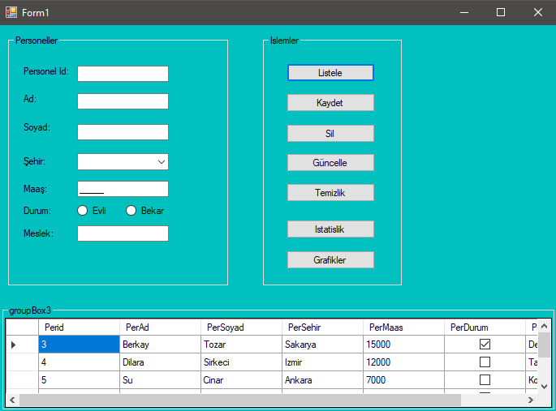

# 📝 Personal Register Prototype — Personal Crud Prototype • (Archived)

 

## 📌 Project Overview

This project is a **.NET Windows Forms** application demonstrating **basic CRUD operations** on a SQL Server database using **ADO.NET** and **DataSet**.  
It was developed during an early learning phase to practice **database connectivity**, **data manipulation**, and **form-based UI design** without using Entity Framework or modern ORMs.  
> 📌 **Archived** — This project is no longer being updated. It’s kept as part of my **learning history** and also serves as a **reference/template** for future projects I may revisit.

 

## 🖼️ Screenshots
Shown below in order:  
**1. Form**

  
  
  

 

## 🧰 Tech Stack

  
  
  
  

 

## 📜 License
This project is licensed under the [MIT License](./LICENSE).

---

© 2025 Yusuf Okan Sirkeci — [Hereetria](https://github.com/Hereetria)
